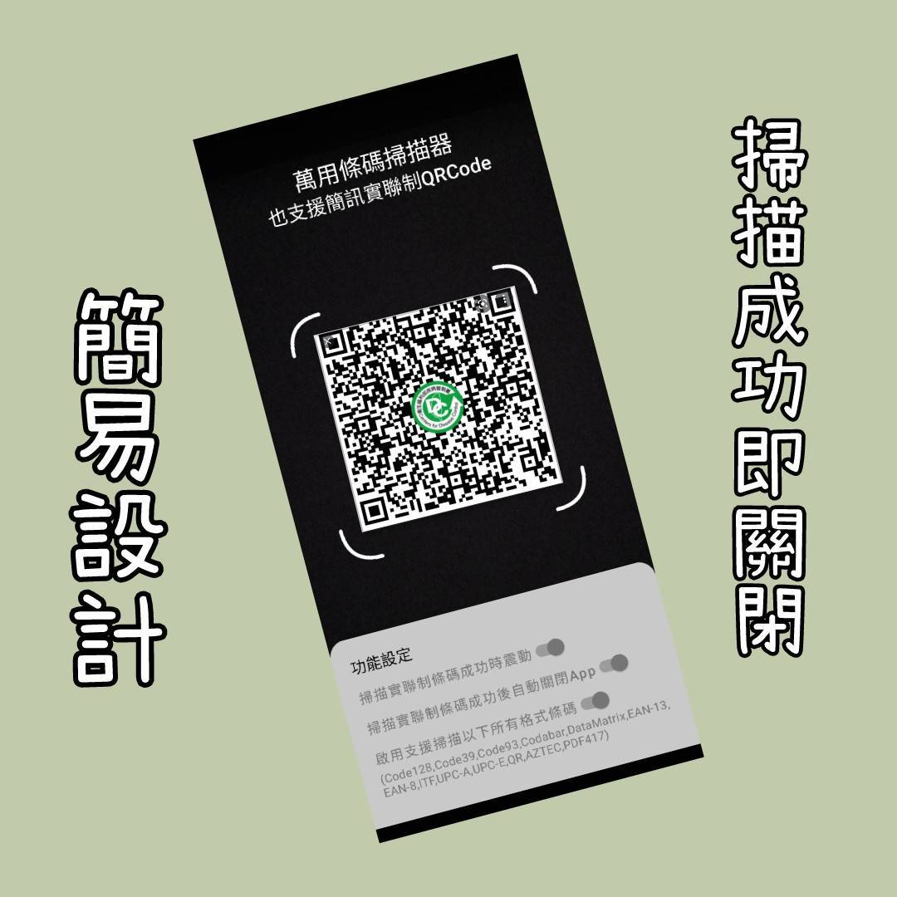
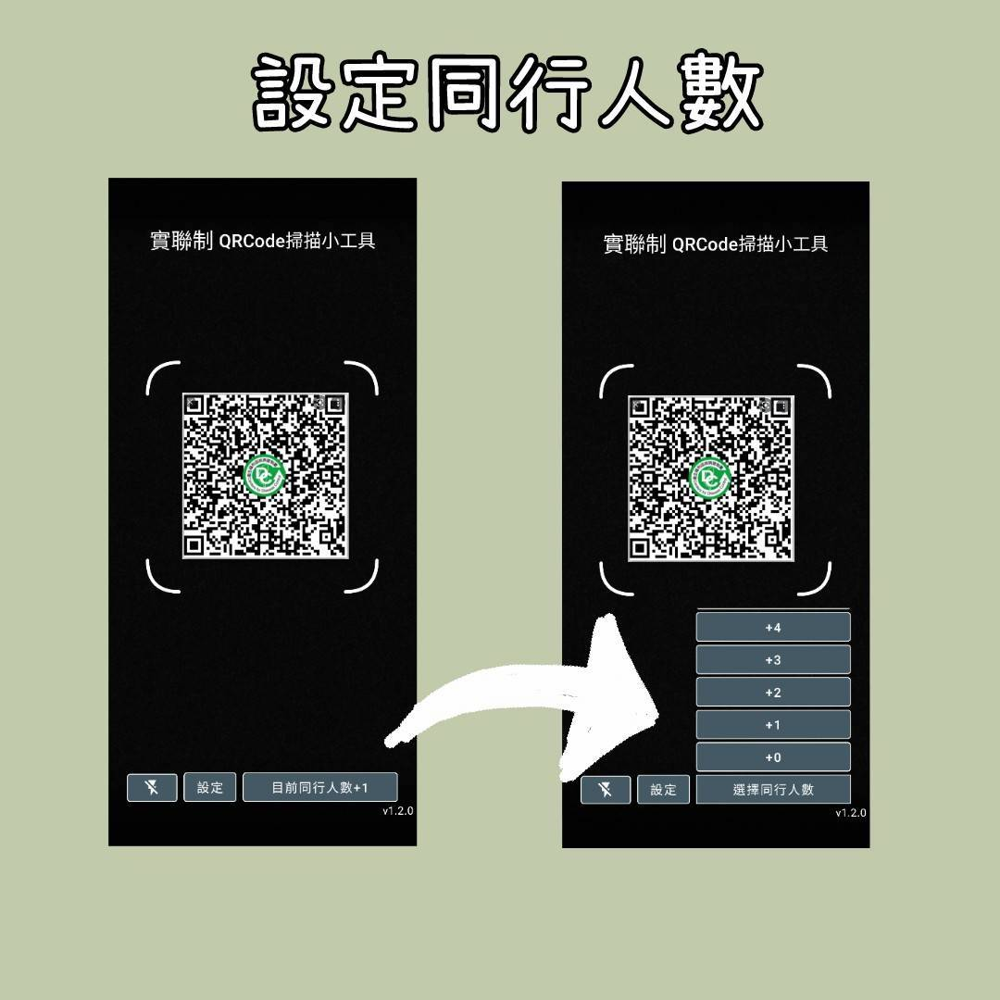

# 實聯制QRCode掃描器

This is a simple app for "簡訊實聯制" in Taiwan

## Technologies
- Compose
- CameraX
- MLKit
- DataStore

## Reference
- [using-googles-mlkit-and-camerax-for-lightweight-barcode-scanning](https://beakutis.medium.com/using-googles-mlkit-and-camerax-for-lightweight-barcode-scanning-bb2038164cdc)
- [ml-kit/guides](https://developers.google.com/ml-kit/guides)
- [Jetpack-Compose-Playground](https://foso.github.io/Jetpack-Compose-Playground/material/switch/)
- [CodeLab for android-proto-datastore](https://developer.android.com/codelabs/android-proto-datastore#0)
- [Accompanist](https://github.com/google/accompanist)
- [Lottie for Android Compose](https://github.com/airbnb/lottie/blob/master/android-compose.md)

## Screenshots

